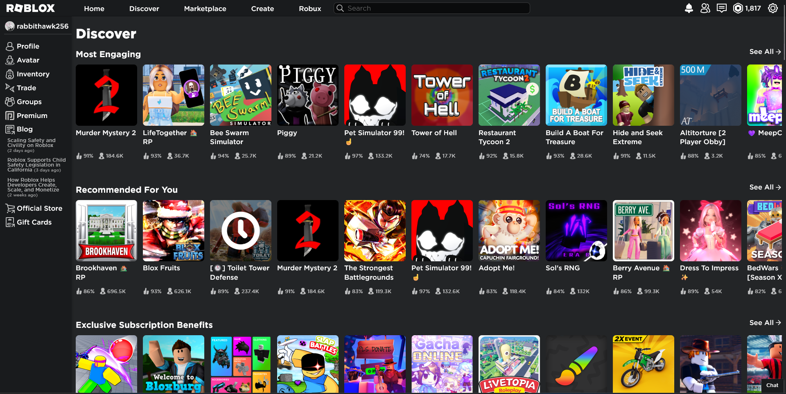

Roblox is a game I've always held near and dear to my heart. I signed up to it  on December 25th, 2013—as of writing this post, it's been just over 10 years! However, as time passed, Roblox did grow with the times, the platform's games (or, officially known as "Experiences") have been out-competed by—to put it nicely—flashy, click-bait games designed for the sole purpose of extracting as many Robux, the platform's digital currency, from as many players as possible.

## The Endless Monetisation Machine

The "discovery" page seem to massively damage someone's ability to find these smaller communities; genre search was removed from the discover page in 2017, and it returned at some point in a less featured state; only having few genres mixed in with the more "Roblox-focused" genres, like "Popular with Premium" and "Top Earning.

## Difficult Niches

Roblox is a community which I find the best experience comes out of finding these small, niche communities surrounding one specific concept; whether it be [railway simulation](https://www.roblox.com/games/696347899/Stepford-County-Railway), [role-play](https://www.roblox.com/games/2534724415/Emergency-Response-Liberty-County), or, in my case, [reactor cores](https://www.roblox.com/games/17541193/Pinewood-Computer-Core).